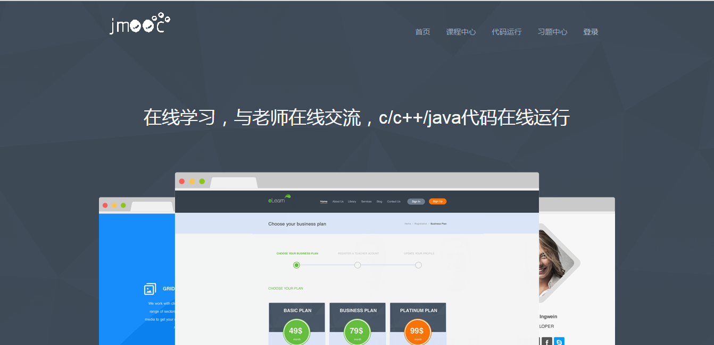
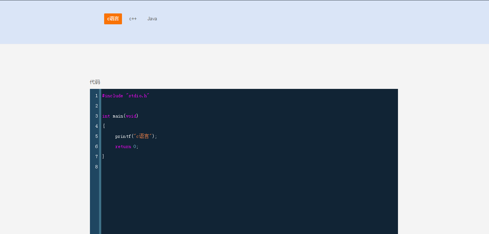
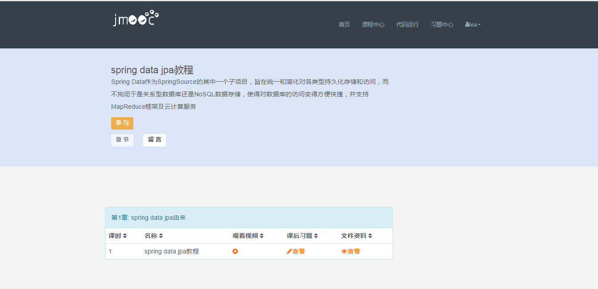
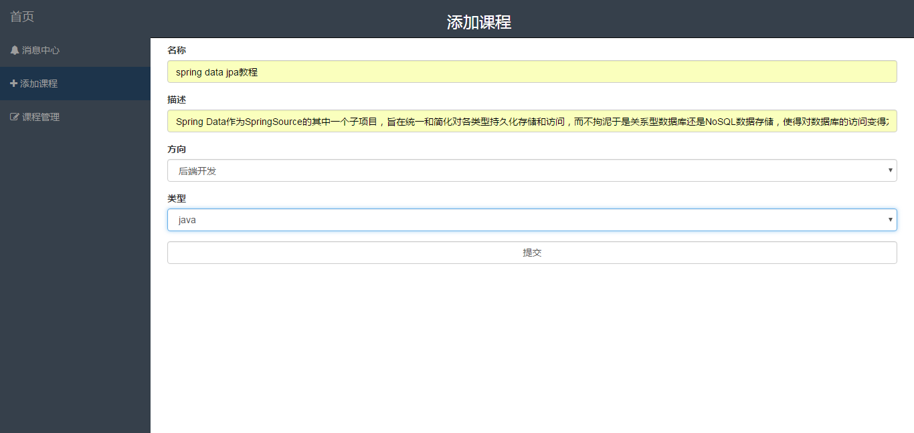
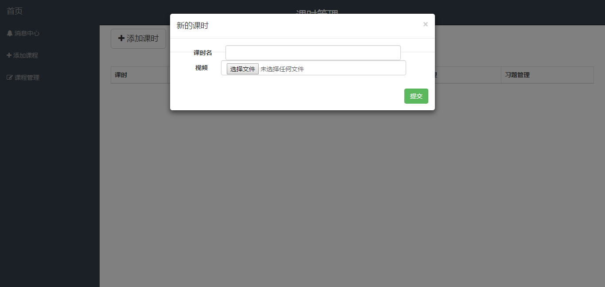
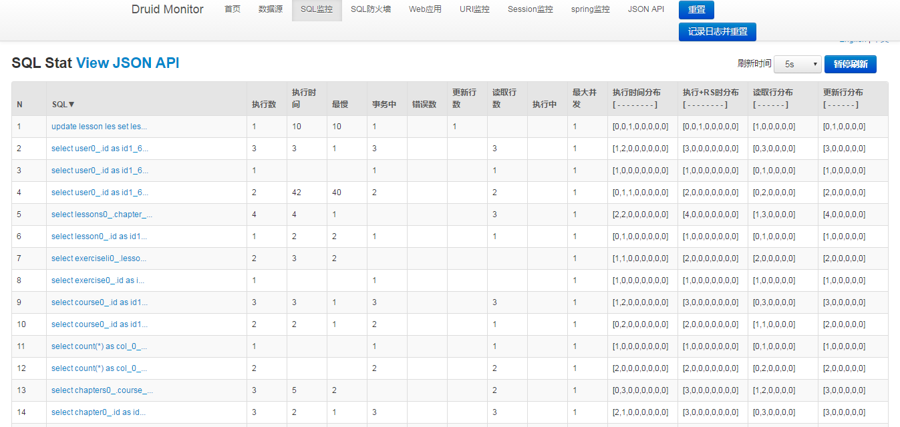

# jmooc

---

[github地址](https://github.com/jcalaz/jmooc)
## 开源云课堂网站

> 做的毕设，类似于慕课网的云课堂，并且可以在线运行c/c++/java代码，前端用的bootstrap模板，目前安全性较低，正在逐步加上spring security，提高安全性。其中在线代码运行由一个OJ系统修改而来，可以运行简单代码。

#### 所用技术
 - springBoot
 - springMVC: MVC框架
 - undertow/tomcat: web容器
 - spring data jpa: ORM框架
 - freemarker: 模板引擎
 - lombok: 工具
 - ehcache: 缓存
 - bootstrap: css/html框架
 - mysql: 数据库
 - druid: 数据库连接池及数据库监控
 - nginx: 静态文件服务器
 - OJ: [online-judge](https://git.oschina.net/jungle/online-judge)
 
---
#### 预览

**首页**

**c/c++/java在线代码运行**

**课程展示**

**课程添加**

**课时添加**

**druid监控**
